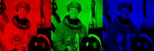

# Channels Filters

## [ExtractChannel](./extractchannel.md)

Extract a single channel from an image.

**Parameters:** `channel`

## [MergeChannels](./mergechannels.md)

Merge R, G, B grayscale channels back into an RGB image.

## [SplitChannels](./splitchannels.md)

Split RGB/RGBA image into individual channel images.
