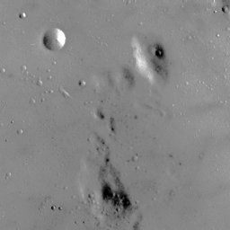
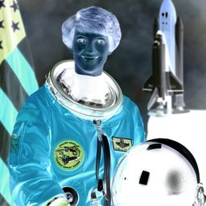
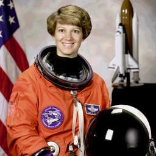

# Color Filters

## [AutoContrast](./autocontrast.md)

Automatically adjust contrast based on image histogram.

**Parameters:** `cutoff`, `preserve_tone`

## [Brightness](./brightness.md)

Adjust image brightness.

**Parameters:** `factor`

## [Contrast](./contrast.md)

Adjust image contrast.

**Parameters:** `factor`

## [Equalize](./equalize.md)

Equalize the image histogram.

## [FalseColor](./falsecolor.md)

Apply false color using matplotlib colormaps.

**Parameters:** `colormap`, `input_min`, `input_max`, `reverse`

## [Grayscale](./grayscale.md)

Convert to grayscale.

**Parameters:** `method`

## [Invert](./invert.md)

Invert colors (negative).

## [Posterize](./posterize.md)

Reduce the number of bits per color channel.

**Parameters:** `bits`

## [Saturation](./saturation.md)

Adjust color saturation.

**Parameters:** `factor`

## [Sharpness](./sharpness.md)

Adjust image sharpness.

**Parameters:** `factor`

## [Solarize](./solarize.md)

Invert pixels above a threshold for a solarized effect.

**Parameters:** `threshold`

## [Threshold](./threshold.md)

Binary threshold filter.

**Parameters:** `value`
