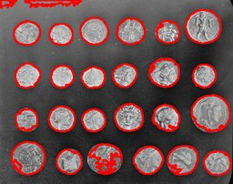
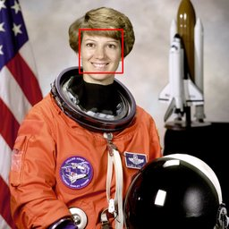

# Detection Filters

## [ContourDetector](./contourdetector.md)

Detect contours in images.

**Parameters:** `threshold`, `min_area`, `color`, `thickness`

## [EyeDetector](./eyedetector.md)

Detect eyes in images using OpenCV Haar cascades.

**Parameters:** `scale_factor`, `min_neighbors`, `color`, `thickness`

## [FaceDetector](./facedetector.md)

Detect faces in images using OpenCV Haar cascades.

**Parameters:** `scale_factor`, `min_neighbors`, `min_size`, `use_profile`, ...
