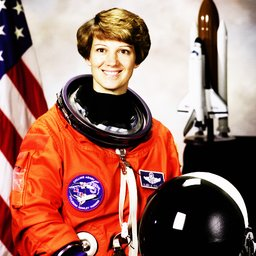

# Exposure Filters

## [AdjustGamma](./adjustgamma.md)

Gamma correction for exposure adjustment.

**Parameters:** `gamma`, `gain`

## [AdjustLog](./adjustlog.md)

Logarithmic correction for exposure adjustment.

**Parameters:** `gain`, `inv`

## [AdjustSigmoid](./adjustsigmoid.md)

Sigmoid (S-curve) contrast adjustment.

**Parameters:** `cutoff`, `gain`, `inv`

## [MatchHistograms](./matchhistograms.md)

Match histogram to a reference image.

**Parameters:** `channel_axis`

## [RescaleIntensity](./rescaleintensity.md)

Rescale image intensity to a specified range.

**Parameters:** `in_range`, `out_range`
