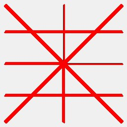

# Geometry Filters

## [DrawGeometry](./drawgeometry.md)

Draw geometries onto an image.

**Parameters:** `color`, `thickness`

## [ExtractRegions](./extractregions.md)

Extract image regions based on geometry bounding boxes.

**Parameters:** `padding`, `min_size`

## [HoughCircleDetector](./houghcircledetector.md)

Detect circles using Hough transform.

**Parameters:** `dp`, `min_dist`, `param1`, `param2`, ...

## [HoughLineDetector](./houghlinedetector.md)

Detect lines using probabilistic Hough transform.

**Parameters:** `rho`, `theta`, `threshold`, `min_length`, ...

## [MergeRegions](./mergeregions.md)

Merge processed regions back into original image.

**Parameters:** `blend_edges`, `feather_size`
