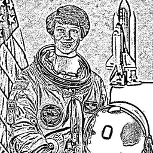

# Histogram Filters

## [AdaptiveThreshold](./adaptivethreshold.md)

Adaptive thresholding based on local image regions.

**Parameters:** `max_value`, `method`, `block_size`, `c`

## [CLAHE](./clahe.md)

Contrast Limited Adaptive Histogram Equalization.

**Parameters:** `clip_limit`, `tile_size`

## [EqualizeHist](./equalizehist.md)

Histogram equalization to improve contrast.

**Parameters:** `per_channel`
