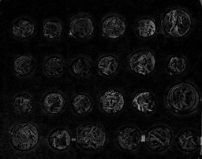
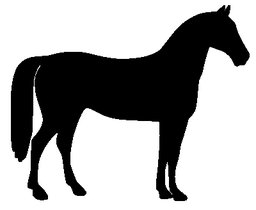
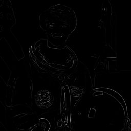
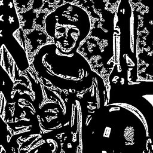
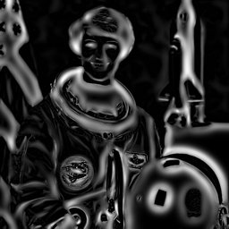
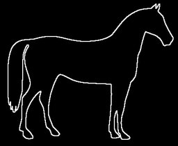
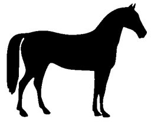
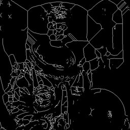
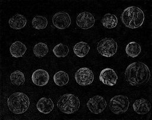

# Morphology Filters

## [BlackHat](./blackhat.md)

Black-hat transform (difference between closing and input).

**Parameters:** `kernel_size`, `shape`

## [Dilate](./dilate.md)

Morphological dilation.

**Parameters:** `kernel_size`, `shape`, `iterations`

## [Erode](./erode.md)

Morphological erosion.

**Parameters:** `kernel_size`, `shape`, `iterations`

## [Frangi](./frangi.md)

Frangi vesselness filter for vessel/ridge detection.

**Parameters:** `scale_min`, `scale_max`, `scale_step`, `beta1`, ...

## [Hessian](./hessian.md)

Hessian-based ridge detection (general-purpose).

**Parameters:** `scale_min`, `scale_max`, `scale_step`, `beta`, ...

## [MedialAxis](./medialaxis.md)

Compute the medial axis transform.

**Parameters:** `return_distance`

## [Meijering](./meijering.md)

Meijering neuriteness filter for neural structure detection.

**Parameters:** `scale_min`, `scale_max`, `scale_step`, `black_ridges`

## [MorphClose](./morphclose.md)

Morphological closing (dilation followed by erosion).

**Parameters:** `kernel_size`, `shape`

## [MorphGradient](./morphgradient.md)

Morphological gradient (difference between dilation and erosion).

**Parameters:** `kernel_size`, `shape`

## [MorphOpen](./morphopen.md)

Morphological opening (erosion followed by dilation).

**Parameters:** `kernel_size`, `shape`

## [RemoveSmallHoles](./removesmallholes.md)

Fill small holes in binary objects.

**Parameters:** `area_threshold`, `connectivity`

## [RemoveSmallObjects](./removesmallobjects.md)

Remove small connected regions from binary image.

**Parameters:** `min_size`, `connectivity`

## [Sato](./sato.md)

Sato tubeness filter for 2D/3D tubular structure detection.

**Parameters:** `scale_min`, `scale_max`, `scale_step`, `black_ridges`

## [Skeletonize](./skeletonize.md)

Reduce binary shapes to 1-pixel-wide skeleton.

**Parameters:** `method`

## [TopHat](./tophat.md)

Top-hat transform (difference between input and opening).

**Parameters:** `kernel_size`, `shape`
