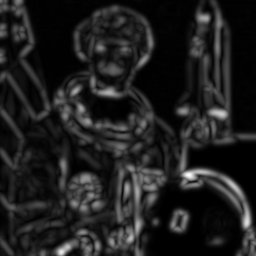
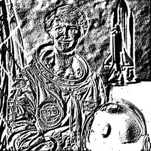

# Texture Filters

## [Gabor](./gabor.md)

Gabor filter for texture analysis.

**Parameters:** `frequency`, `theta`, `sigma_x`, `sigma_y`, ...

## [GaborBank](./gaborbank.md)

Apply a bank of Gabor filters at multiple orientations.

**Parameters:** `frequency`, `n_orientations`

## [LBP](./lbp.md)

Local Binary Pattern texture descriptor.

**Parameters:** `radius`, `n_points`, `method`
