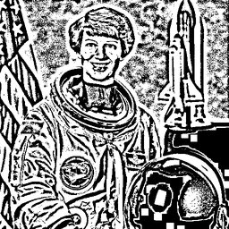

# Threshold Filters

## [ThresholdLi](./thresholdli.md)

Li's minimum cross-entropy thresholding.

**Parameters:** `tolerance`

## [ThresholdNiblack](./thresholdniblack.md)

Niblack's local thresholding.

**Parameters:** `window_size`, `k`

## [ThresholdOtsu](./thresholdotsu.md)

Otsu's automatic thresholding.

**Parameters:** `nbins`

## [ThresholdSauvola](./thresholdsauvola.md)

Sauvola's local thresholding.

**Parameters:** `window_size`, `k`, `r`

## [ThresholdTriangle](./thresholdtriangle.md)

Triangle thresholding algorithm.

**Parameters:** `nbins`

## [ThresholdYen](./thresholdyen.md)

Yen's maximum entropy thresholding.

**Parameters:** `nbins`
