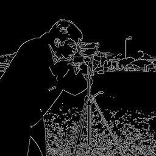

# Canny




Canny edge detection.

Detects edges using the Canny algorithm with hysteresis thresholding.

Parameters:
    threshold1: Lower threshold for hysteresis (default 100)
    threshold2: Upper threshold for hysteresis (default 200)
    aperture_size: Sobel kernel size (3, 5, or 7)

Example:
    'canny(100,200)' or 'canny(threshold1=50,threshold2=150)'

## Parameters

| Name | Type | Default | Description |
|------|------|---------|-------------|
| `threshold1` | float | 100.0 | Lower threshold for hysteresis (default 100) |
| `threshold2` | float | 200.0 | Upper threshold for hysteresis (default 200) |
| `aperture_size` | int | 3 | Sobel kernel size (3, 5, or 7) |

## Examples

```
canny(100,200)
```

## Frameworks

Native support: CV, RAW
