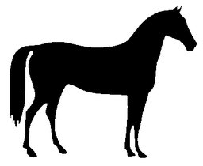

# Dilate




Morphological dilation.

Expands boundaries of foreground objects. Useful for filling small
holes and connecting nearby objects.

Parameters:
    kernel_size: Size of structuring element (default 3)
    shape: Shape of kernel ('rect', 'ellipse', 'cross')
    iterations: Number of times to apply dilation

Example:
    'dilate(3)' or 'dilate(kernel_size=5,iterations=2)'

## Parameters

| Name | Type | Default | Description |
|------|------|---------|-------------|
| `kernel_size` | int | 3 | Size of structuring element (default 3) |
| `shape` | str | 'rect' | Shape of kernel ('rect', 'ellipse', 'cross') |
| `iterations` | int | 1 | Number of times to apply dilation |

## Examples

```
dilate(3)
```

## Frameworks

Native support: CV, RAW
