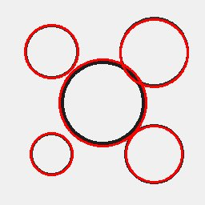

# HoughCircleDetector




Detect circles using Hough transform.

Uses OpenCV's HoughCircles to detect circular shapes in images.
Works best on edge-detected or high-contrast images.

Parameters:
    dp: Inverse ratio of accumulator resolution (default 1.0)
    min_dist: Minimum distance between circle centers
    param1: Higher threshold for Canny edge detector
    param2: Accumulator threshold for circle centers
    min_radius: Minimum circle radius (0 = no minimum)
    max_radius: Maximum circle radius (0 = no maximum)

Example:
    'houghcircledetector(min_dist=30,param2=50)'

## Aliases

- `circles`

## Parameters

| Name | Type | Default | Description |
|------|------|---------|-------------|
| `dp` | float | 1.0 | Inverse ratio of accumulator resolution (default 1.0) |
| `min_dist` | float | 20.0 | Minimum distance between circle centers |
| `param1` | float | 50.0 | Higher threshold for Canny edge detector |
| `param2` | float | 30.0 | Accumulator threshold for circle centers |
| `min_radius` | int | 0 | Minimum circle radius (0 = no minimum) |
| `max_radius` | int | 0 | Maximum circle radius (0 = no maximum) |

## Examples

```
houghcircledetector(min_dist=30,param2=50)
```

## Frameworks

Native support: CV, RAW
