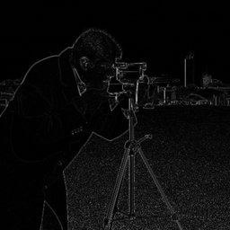

# Laplacian




Laplacian edge detection.

Computes Laplacian of the image for edge detection.

Parameters:
    kernel_size: Kernel size (1, 3, 5, or 7)
    scale: Scale factor
    normalize: Normalize output to 0-255 range

Example:
    'laplacian(3)' or 'laplacian(kernel_size=5)'

## Parameters

| Name | Type | Default | Description |
|------|------|---------|-------------|
| `kernel_size` | int | 3 | Kernel size (1, 3, 5, or 7) |
| `scale` | float | 1.0 | Scale factor |
| `normalize` | bool | True | Normalize output to 0-255 range |

## Examples

```
laplacian(3)
```

## Frameworks

Native support: CV, RAW
