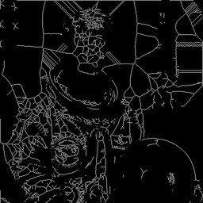

# MedialAxis




Compute the medial axis transform.

Returns the skeleton plus distance transform values.
The distance at each skeleton point indicates the radius
of the maximum inscribed disk.

Requires: scikit-image (optional dependency)

Parameters:
    return_distance: If True, also stores distance in context

Example:
    'medialaxis()'

## Parameters

| Name | Type | Default | Description |
|------|------|---------|-------------|
| `return_distance` | bool | True | If True, also stores distance in context |

## Examples

```
medialaxis()
```

## Frameworks

Native support: RAW

## Requirements

- scikit-image
