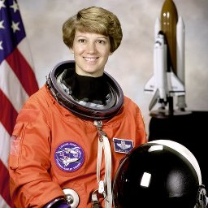

# Resize

Resize image.

Either specify size (width, height) or scale factor.
Uses OpenCV for ~20x faster performance (does not preserve input framework).

:param size: Target size as (width, height)
:param scale: Scale factor (alternative to size)
:param interpolation: Interpolation method ('lanczos', 'linear', 'area', 'cubic')
                     Default is 'lanczos' for quality, 'area' recommended for downscaling.

## Parameters

| Name | Type | Default | Description |
|------|------|---------|-------------|
| `size` | int | None | Target size as (width, height) |
| `scale` | float | None | Scale factor (alternative to size) |
| `interpolation` | str | 'lanczos' | Interpolation method ('lanczos', 'linear', 'area', 'cubic') Default is 'lanczos' for quality, 'area' recommended for downscaling. |

## Frameworks

Native support: CV, PIL
