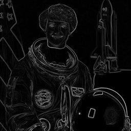

# Scharr




Scharr edge detection.

Computes gradients using the Scharr operator, which is more accurate
than Sobel for rotational symmetry.

Parameters:
    dx: Order of derivative in x direction (0 or 1)
    dy: Order of derivative in y direction (0 or 1)
    scale: Scale factor for computed values
    normalize: Normalize output to 0-255 range

Example:
    'scharr(1,0)' for horizontal edges
    'scharr(0,1)' for vertical edges
    'scharr(1,1)' for both directions

## Parameters

| Name | Type | Default | Description |
|------|------|---------|-------------|
| `dx` | int | 1 | Order of derivative in x direction (0 or 1) |
| `dy` | int | 1 | Order of derivative in y direction (0 or 1) |
| `scale` | float | 1.0 | Scale factor for computed values |
| `normalize` | bool | True | Normalize output to 0-255 range |

## Examples

```
scharr(1,0)
```
```
scharr(0,1)
```
```
scharr(1,1)
```

## Frameworks

Native support: CV, RAW
