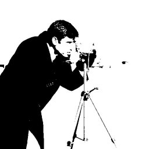

# Threshold

Binary threshold filter.

Pixels above threshold become white, below become black.

## Parameters

| Name | Type | Default | Description |
|------|------|---------|-------------|
| `value` | int | 128 |  |

## Frameworks

Native support: RAW, CV
