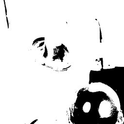

# ThresholdTriangle




Triangle thresholding algorithm.

Works well for unimodal histograms (one peak).
Finds threshold at maximum distance from line
connecting histogram peak to tail.

Requires: scikit-image (optional dependency)

Parameters:
    nbins: Number of histogram bins (default 256)

Example:
    'thresholdtriangle()' or 'thresholdtriangle(nbins=128)'

## Parameters

| Name | Type | Default | Description |
|------|------|---------|-------------|
| `nbins` | int | 256 | Number of histogram bins (default 256) |

## Examples

```
thresholdtriangle()
```

## Frameworks

Native support: RAW

## Requirements

- scikit-image
