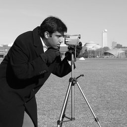

# UnsharpMask

Unsharp mask sharpening.

radius: Blur radius
percent: Sharpening strength (0-500)
threshold: Minimum brightness change to sharpen

## Parameters

| Name | Type | Default | Description |
|------|------|---------|-------------|
| `radius` | float | 2.0 | Blur radius |
| `percent` | int | 150 | Sharpening strength (0-500) |
| `threshold` | int | 3 | Minimum brightness change to sharpen |

## Frameworks

Native support: PIL
