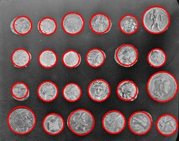

# Circle Detection




Detect all 24 coins using tuned Hough circle detection

**Category:** Detection

## Inputs

- **source**: RGB8, RGBA8, GRAY8

## DSL

```
[c: houghcircledetector dp=0.06 min_dist=14.0 param1=230.0 param2=30.0 min_radius=10 max_radius=40]; drawgeometry input=source geometry=c color=#ff0000 thickness=2
```

## Usage

```python
from imagestag.tools.preset_registry import get_preset

preset = get_preset('circle_detection')

# As graph
graph = preset.to_graph()
result = graph.execute(image)
```

## Graph Structure

```
source: PipelineSource
detect_circles: HoughCircleDetector(dp=0.06, min_dist=14.0, param1=230.0, param2=30.0, min_radius=10, max_radius=40)
draw_circles: DrawGeometry(color=#FF0000, thickness=2)
output: PipelineOutput
```
